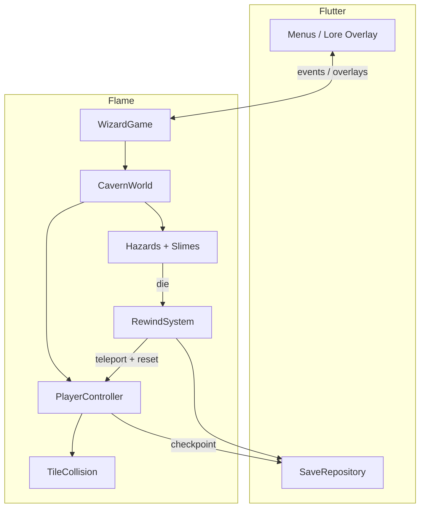

# Wizard: Mê Lộ — Ý tưởng, Kiến trúc, Logic & Thuật toán

> Dựa trên asset pack **Mossy Cavern** (`../MossyCavern`) + atlas Free Texture Packer (`Slimes/texture.json`).  
> Đồng bộ với [`PLAN.md`](./PLAN.md).

---

## 0. Asset thực tế → ý tưởng game

Mossy Cavern không chỉ là skin — nó **định hình** cảm giác chơi:

| Asset | Vai trò trong “Wizard: Mê Lộ” |
|-------|-------------------------------|
| `Mossy - TileSet.png` (3584², tile **512×512**) | Hang rêu, autotile sàn/tường; world unit = 1 tile scaled |
| `Decorations&Hazards` — **spines/gai** | Rage hazard chính (sàn + trần) |
| `FloatingPlatforms` | Fake safe zone, gap dash, corridor “cay cú” |
| BlueWizard Idle(20) / Walk(20) / Jump(8) / Dash(16×3) | FSM animation khớp platformer + dash frame-critical |
| Slime Green/Orange (30 frame squash-stretch) | Patrol + **bệ nhảy ảo** (bounce theo góc) |
| Plant Wind / PlantJump / Poison | Telegraph gió; bẫy thực vật; fake floor “rêu sạt” |
| BackgroundDecoration / MossyHills / Hanging Plants | Parallax depth — hang càng sâu càng tối |

**Quyết định kỹ thuật quan trọng:** art gốc rất lớn (512px/frame). Trong Flame scale xuống ~**0.15–0.25** (world tile ~64–96px trên mobile) để giữ 60fps và hitbox dễ cân bằng.

---

## 1. Ý tưởng cốt lõi (Design Pillars)

```
ĐỌC MAP  >  REACT NHANH  >  CHỊU PHẠT  >  HỌC LẠI
     ↑______________ rewind / death echo ______________|
```

1. **Time-loop là luật vật lý**, không phải menu Game Over.  
2. **Asset dạy cơ chế**: squash slime = bounce window; plant wind = vùng gió; gai phát sáng = hitbox nguy hiểm.  
3. **Rage phải fair**: chết vì pattern, không vì RNG thuần.  
4. **Data-driven traps**: level designer chỉnh Tiled properties, code chỉ là factory + state machine.

---

## 2. Kiến trúc tổng thể

### 2.1 Hai lớp runtime

```
┌─────────────────────────────────────────────┐
│  Flutter Shell (UI)                         │
│  Title / Pause / Lore overlay / Settings    │
│  Riverpod: SaveGame, Settings, LoreFlags    │
└──────────────────┬──────────────────────────┘
                   │ GameWidget + overlays
┌──────────────────▼──────────────────────────┐
│  Flame Runtime                              │
│  WizardGame → CavernWorld → Systems         │
│  Components (Player, Slime, Hazards, …)     │
└─────────────────────────────────────────────┘
```

- **Flutter** sở hữu persistence & menu (dễ test, dễ localize).  
- **Flame** sở hữu simulation 60fps (physics, collision, VFX).  
- Giao tiếp qua **events** (`PlayerDied`, `CheckpointActivated`, `LoreUnlocked`) — không để UI đọc trực tiếp component mỗi frame.

### 2.2 Cấu trúc module (tái sử dụng)

```
lib/
  game/
    wizard_game.dart           # FlameGame + HasCollisionDetection
    world/cavern_world.dart
    player/                    # component + controller + anim FSM
    actors/slime/              # slime + bounce solver
    hazards/                   # spike, fake_floor, wind, gravity
    interactables/             # checkpoint, tablet
    systems/                   # rewind, checkpoint, lore
    levels/level_loader.dart   # Tiled → components
  assets/
    atlas/                     # Free Texture Packer loader
    animation_catalog.dart     # map tên clip → frame ranges
  core/
    fixed_step.dart            # physics dt ổn định
    math/bounce.dart           # thuần túy, unit-test được
```

**Nguyên tắc tái sử dụng:** mọi trap kế thừa `HazardComponent`; mọi actor có animation dùng chung `AtlasAnimationFactory`.

### 2.3 Vòng đời frame (Game Loop)

```
input → intent
  → apply forces (gravity, wind, dash impulse)
  → integrate velocity (fixed dt)
  → resolve AABB vs tiles (sweep / separate axes)
  → collision callbacks (hazard / slime / checkpoint)
  → animation state sync
  → camera follow
  → (nếu dead) rewind pipeline
```

Dùng **fixed timestep** (1/60) cho physics; render interpolate nhẹ nếu cần — quan trọng với dash “đúng frame”.

---

## 3. Pipeline Asset & Free Texture Packer

### 3.1 Format hiện có (`Slimes/texture.json`)

- App: Free Tex Packer 0.6.7  
- Atlas: `texture.png` **1880×2048**  
- Frame: **376×256**, pivot `(0.5, 0.5)`, `trimmed: false`  
- Keys: `SlimeGreen/SlimeBasic_00000.png` … `_00029` (30 frame)  
- Orange chưa pack vào atlas này → pack thêm hoặc atlas riêng `slime_orange.json`

### 3.2 Loader dùng chung (ý tưởng API)

```dart
/// Parse Free Texture Packer JSON → map name → Rect trên atlas.
class FreeTexAtlas {
  Future<void> load(String jsonPath, String imagePath);
  Sprite sprite(String frameName);
  SpriteAnimation animation({
    required List<String> frames,
    required double stepTime,
    bool loop = true,
  });
}
```

Thứ tự frame: sort theo số đuôi `_00000` → `_00029` (regex), **không** tin thứ tự key trong JSON object.

### 3.3 Mapping animation slime (đề xuất cắt clip)

30 frame squash-stretch → chia clip theo cảm giác chơi:

| Clip | Frame gợi ý | Dùng khi |
|------|-------------|----------|
| `idle` / `patrol` | 0–9 (nhịp thở) | Di chuyển ngang |
| `squash` | 10–16 (dẹt) | Player vừa land — **cửa sổ bounce** |
| `stretch` | 17–24 (dài) | Đang phóng player |
| `recover` | 25–29 | Về idle |

Orange slime: cùng clip map, đổi tint hoặc atlas — **logic bounce tái sử dụng 100%**.

### 3.4 BlueWizard

Chưa atlas → 2 hướng:

1. **MVP nhanh:** `SpriteAnimationData.sequenced` từ list PNG (Idle/Walk/Jump).  
2. **Ship:** pack Idle/Walk/Jump/Dash bằng Free Texture Packer giống slime → cùng `FreeTexAtlas`.

Dash có 3 biến thể (`Dash2`, `Dash3`, `DashEffect`) — dùng body Dash2/3 + overlay `DashEffect` (additive / separate component).

### 3.5 Tileset → Tiled

- Tile size nguồn: **512×512**.  
- Trong Tiled: giữ 512 hoặc downsample atlas còn 128/64 để editor nhẹ.  
- Collision: layer `ground` + object shapes cho gai (AABB hẹp hơn visual).

---

## 4. Logic hệ thống chính

### 4.1 Player Controller (Platformer)

**State machine:**

```
Idle ↔ Run → Jump/Fall ↔ Dash
         ↘ Dead → Rewinding → Idle (tại checkpoint)
```

**Biến cốt lõi:**

| Biến | Ý nghĩa |
|------|---------|
| `velocity` | px/s world |
| `facing` | ±1 |
| `coyoteTimer` | còn được jump sau khi rời mép |
| `jumpBufferTimer` | nhấn jump sớm trước khi chạm đất |
| `dashCooldown` / `dashTimer` | cửa sổ dash |
| `gravityScale` | 1.0 hoặc -1.0 (gravity invert) |
| `windAccel` | vector cộng thêm mỗi frame trong WindZone |

**Feel bắt buộc (rage fair):**

- Coyote ~80–120ms  
- Jump buffer ~100–150ms  
- Variable jump height (nhả nút → cắt `vy`)  
- Dash: constant velocity horizontal trong ~120–180ms, tắt gravity hoặc giảm mạnh

### 4.2 Collision tiles (thuật toán)

**AABB swept separation theo trục** (ổn định, dễ debug hơn continuous phức tạp):

```
1. moveX = vx * dt
2. resolve horizontal vs solid tiles (push out)
3. moveY = vy * dt
4. resolve vertical; nếu đụng sàn từ trên → grounded = true, vy = 0
5. one-way platforms: chỉ collide khi vy > 0 và chân cắt mép trên
```

Hazard **không** resolve như solid — chỉ `onCollision` → `kill()`.

Gai: hitbox **nhỏ hơn sprite ~15–25%** (feel tốt) nhưng visual “đầy” để gây áp lực tâm lý.

### 4.3 Rewind / Checkpoint (Time-loop)

```
onFatalHit:
  lockInput = true
  record DeathEcho(position, facing, timestamp)
  play rewind VFX (0.3–0.6s)
  teleport player → lastCheckpoint.spawn
  resetSegmentTransients()   # fake floors, slime pos, moving platforms
  deathCount++
  lockInput = false
```

**Checkpoint xa xỉ:** chỉ activate khi chạm tượng; không auto-save giữa đường.  
**Soft mitigation (Scholar):** sau N death cùng `segmentId`, spawn soft statue tạm (flag save riêng).

### 4.4 Lore

- `LoreTablet` → unlock `loreId` → Flutter overlay typewriter.  
- Death Echo có thể nói tip ngắn map theo `segmentId` (bảng data, không hardcode trong slime).

---

## 5. Thuật toán cạm bẫy & actors

### 5.1 Spike / Spine

```
if hitbox overlaps player && !player.invulnerable:
  player.die(cause: Spike)
```

Trần gai + bounce lệch = combo rage chính với slime.

### 5.2 Fake Safe Zone (rêu sạt / gai ngầm)

State machine:

```
Idle(LooksSafe) --[player landed ≥ delayMs]→ Triggering
Triggering --[anim / wait]→ Hazardous | Collapsed
Hazardous --[rewind / timer]→ Idle   # nếu respawn_on_rewind
```

Telegraph lần đầu: particle bụi / plant shake (`PlantJump` frames).  
Zone sâu: `telegraph: false`.

### 5.3 Slime bounce (bệ nhảy ảo) — công thức

Khi player land từ trên (`vy > 0`) và chân cắt “bounce pad” (phần trên slime ~30% height):

```
offsetX = player.center.x - slime.center.x
halfW   = slime.bounceWidth / 2
t       = clamp(offsetX / halfW, -1, 1)     // -1 mép trái … +1 mép phải

bounceVy = -baseForce * (1 - abs(t) * tipPenalty)
bounceVx = t * lateralForce + player.vx * inherit

player.velocity = (bounceVx, bounceVy)
slime.play(squash → stretch)
```

- `|t|` nhỏ (giữa lưng) → bay thẳng lên, an toàn hơn.  
- `|t|` lớn (mép) → `bounceVx` lớn → dễ đập **trần gai**.  
- Orange slime: `baseForce` cao hơn / `lateralForce` mạnh hơn (khó hơn).

Patrol: di chuyển A↔B; đảo hướng khi tới marker hoặc không còn sàn phía trước (raycast 1 tile).

### 5.4 Last-frame Dash gap

Không cần frame-perfect tuyệt đối trên mobile:

```
gapClear = dashSpeed * dashDuration + colliderWidth
design gap ≈ gapClear * 0.92 … 1.0
```

Player phải dash khi `timeToFallPastEdge ∈ dashWindow`.  
Thuật toán **assist nhẹ (optional):** nếu nhấn dash trong ±2 frame sweet spot và `intent.dash`, snap bắt đầu dash — bật trong Scholar mode.

### 5.5 Wind zone

Mỗi tick khi AABB player ∩ wind:

```
player.velocity += windDir * windStrength * dt
// hoặc: player.velocity.x = lerp(vx, targetDrift, k)
```

Plant Wind animation trong zone = telegraph miễn phí từ asset.

### 5.6 Gravity inversion

```
gravityScale = -1
flip sprite / camera cue (rune tint)
grounded = collision với “trần” theo hướng gravity mới
```

Segment ngắn, có rune visual — tránh flip bất ngờ giữa dash.

---

## 6. Level pipeline (Tiled → runtime)

```
.tmx
  tile layers: ground, deco, bg
  object groups:
    spawn, checkpoints, spikes, fake_floors,
    wind_zones, gravity_zones, slimes, tablets
         │
         ▼
LevelLoader.spawn(world)
         │
         ▼
Component tree sẵn sàng chơi
```

Mỗi object: `type` + custom properties → factory:

```dart
switch (obj.type) {
  case 'slime': return SlimeComponent.fromTiled(obj);
  case 'fake_floor': return FakeFloorHazard.fromTiled(obj);
  ...
}
```

**Tái sử dụng:** `fromTiled` pattern cho mọi entity — thêm trap mới = thêm case + class, không sửa loader lõi nhiều.

---

## 7. Camera, scale & performance

| Chủ đề | Cách làm |
|--------|----------|
| Scale | `viewfinder.zoom` sao cho ~12–16 tile ngang màn hình |
| Camera | follow player, deadzone nhỏ, clamp trong map bounds |
| Parallax | 2–3 layer: Hills / BackgroundDecoration / Hanging Plants |
| Batch | static deco → `SpriteBatch` hoặc tilemap; animated = component |
| Atlas | gộp wizard + slime + plants (nhiều texture.json) giảm bind texture |
| Cull | chỉ update enemy/hazard gần camera ± margin |

Post FX (bloom/vignette) **không có trong pack** → Flutter overlay gradient tối + particle lửa ma / bụi tự viết dần.

---

## 8. Sơ đồ hệ thống (tóm tắt)



---

## 9. Thứ tự triển khai kỹ thuật (gắn asset)

1. **Bootstrap Flame + scale** tile 512 → world size ổn trên device.  
2. **FreeTexAtlas** đọc `Slimes/texture.json` + render 1 slime idle.  
3. **Player** Idle/Walk/Jump từ PNG sequence + tile collision.  
4. **Spike** từ Decorations&Hazards + Rewind về checkpoint.  
5. **Slime bounce math** + trần gai demo room.  
6. Pack thêm atlas Wizard/Orange/Plants; Fake floor + Wind.  
7. Tiled Zone1 slice + lore tablets.

---

## 10. Rủi ro kỹ thuật từ asset

| Rủi ro | Giải pháp |
|--------|-----------|
| Frame 512 quá nặng | Scale mạnh; atlas; giới hạn animated on-screen |
| Slime frame lớn (376×256) so với wizard 512 | Chuẩn hóa `displaySize` theo hitbox, không theo raw pixel |
| JSON FTP không có animation group | `animation_catalog.dart` cắt range thủ công |
| Gai organic (cong) | Hitbox AABB/capsule xấp xỉ, không pixel-perfect mask |
| Tên file Wizard có space (`Chara - BlueIdle…`) | Normalize khi pack atlas |

---

## 11. Kết luận hướng làm

Game này là **platformer skill + memory** trên nền Mossy Cavern:

- **Kiến trúc:** Flutter UI ↔ Flame simulation, data-driven Tiled, atlas loader dùng chung.  
- **Logic:** FSM player/trap, rewind là transaction reset segment.  
- **Thuật toán then chốt:** AABB axis-separate collision, slime bounce theo offset chuẩn hóa `t`, wind tích phân, dash window thiết kế theo `speed × duration`.

Bám vertical slice (mục 9) trước khi mở rộng zone lore — feel jump/dash/bounce quyết định 80% “cay cú đúng vị”.
